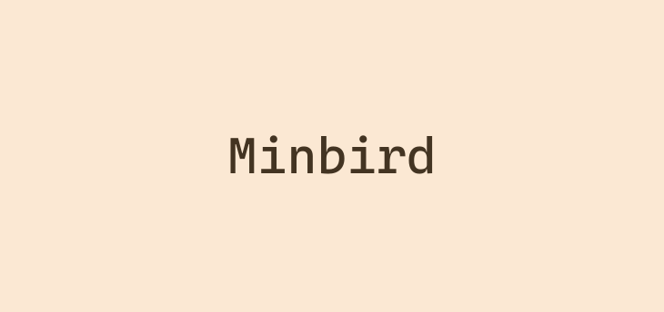

<p align="center">
  
</p>

# Minbird

A minimalistic twitter feed, without an account. Choose the people you want to follow. Finally a quiet twitter.


## Getting started

### Install dependencies

```bash
$ yarn
```

### Serve with hot reload at localhost:3000

```bash
$ yarn dev
```

### Build for production and launch server

```bash
$ yarn build
$ yarn start
```
